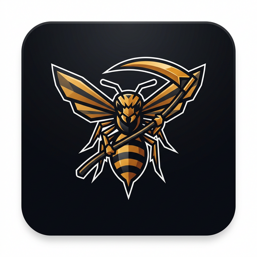

# 🐝 ROIReaper — Жнец Роя

**Официальный сборник мини-игр для ПК на Windows.** Тёмный/светлый официальный интерфейс в стиле офисного пакета, шрифт **Unbounded**, двенадцать проработанных режимов, своя валюта, магазин, анимации, проверка обновлений и страница с информацией о компьютере. Работает полностью офлайн — можно носить на флешке.



## 🎮 Режимы

| Игра | Что внутри |
|---|---|
| 🐝 **Жатва Роя** | Кликер: 8 построек, 13 улучшений, криты, золотая дикая оса, офлайн-доход и престиж (королевское желе) |
| 📦 **Кейсы** | 6 кейсов, прокрутка с замедлением, 5 редкостей, реликты, трофейный зал, бесплатный кейс каждые 20 минут |
| 🎰 **Слоты** | 5×3, 20 линий, вайлды, скаттеры, 10 фриспинов с ×3, крупные заносы |
| 🎡 **Рулетка** | Европейская (одно зеро), полный стол, анимированное колесо и шарик, история, повтор ставок |
| 🃏 **Блэкджек** | Колода 52 карты ×4, удвоение, дилер на 17, блэкджек 3:2 |
| 🎲 **Кости** | Порог «больше/меньше», множитель до ×98, слайдер вероятности |
| 🪙 **Орёл и Решка** | Быстрая монетка, серии побед, 3D-анимация |
| 👑 **Империя Роя** | Пошаговая стратегия как Europa Universalis: карта 5×4, экономика по месяцам, армии, крепости, технологии, события, три ИИ-улья |
| 🥷 **Уклонение** | Аркада с человечком против босса-шефа: WASD/стрелки/мышь, рывок на Space, паттерны атак, near-miss бонусы |
| ⚫ **Шашки** | Русские шашки против ИИ (минимакс, 3 сложности), обязательные взятия, дамки |
| 🂠 **Дурак** | Подкидной, 36 карт, козырь, подкиды, полный ход партии против ИИ |
| 🔢 **2048** | Классика на стрелках/WASD/свайпах, награда за плитку 2048 |

Плюс: 🏪 **магазин** (палитры, скины, рубашки карт, билеты, подковы удачи, усиления),
ежедневные награды, единая валюта 🍯 мёд и престиж 👑 королевское желе, статистика, автосохранение, экспорт/импорт сейва.

## ⌨️ Управление

- **F11** — полноэкранный режим
- **M** — вкл/выкл звук
- **1–9** — быстрый переход к играм
- **WASD / стрелки / мышь** — управление в аркаде, 2048, кликер по пробелу, Space в слотах/костях/монетке
- **P** — пауза в «Уклонении», **R/Enter** — рестарт

## 🖥 Две версии для Windows

### 1. Портативная (для флешки и чужих ПК в колледже)
1. Скачайте `ROIReaper-1.0.0-Portable.zip` из [релизов](https://github.com/kayorissss/ROIReaper/releases).
2. Распакуйте куда угодно (флешка, Рабочий стол).
3. Запустите **`ROIReaper.cmd`** (или `start.vbs` — без мигания консоли).

Установка и права администратора не нужны. Всё хранится локально.

### 2. Установочная
1. Скачайте `ROIReaper-Setup-1.0.0.exe`.
2. Запустите — программа установится в папку профиля (`%LOCALAPPDATA%\ROIReaper`), появятся ярлыки на рабочем столе, в меню Пуск и пункт «Удалить ROIReaper». UAC не требуется.

## 🔄 Обновления

В разделе **Настройки → Обновления** есть кнопка «Проверить обновления». Программа сверяется с GitHub-релизами:
- если вышла новая версия — появляется уведомление со списком изменений;
- загрузка идёт **в самой программе** с процентами, этапами и анимацией;
- также доступна ссылка на страницу релиза и репозиторий.

## 🖧 О компьютере

Раздел «О компьютере» (в Windows-сборке) показывает безопасным read-only способом:
версию и сборку Windows, процессор (ядра/потоки/частоту), ОЗУ и модули, видеокарты и драйверы, диски и свободное место, BIOS/UEFI, Secure Boot, брандмауэр, антивирус, рабочую группу/домен и сетевые адаптеры. Ничего не устанавливается и никуда не отправляется — данные собираются локальным лаунчером через WMI.

## 🛠 Для разработчиков

Требования: Node.js 18+.

```bash
npm install        # зависимости
npm start          # предпросмотр в браузере: http://localhost:8848/index.html
npm test           # автотесты всех режимов (jsdom)
npm run icon       # пересборка иконок из resources/icon-src.png
npm run dist       # сборка Portable ZIP и установочного EXE в dist/
```

Структура:

```
src/renderer/      само приложение (чистый HTML/CSS/JS, без фреймворков)
  js/games/        все мини-игры
windows/           лаунчер (PowerShell + .cmd/.vbs), установка/удаление
resources/         иконки и SFX-модуль установщика
scripts/           сборка иконок и дистрибутивов
tools/             dev-сервер и автотесты
release/           официальные бинарники версий
```

## 🔒 Приватность и лицензия

Программа не собирает персональные данные, не имеет телеметрии и работает офлайн.
Сейв лежит в локальном хранилище браузерного профиля; его можно экспортировать в файл и носить между ПК.

Лицензия — **MIT**. Иконка «Оса-жнец» является частью проекта.
