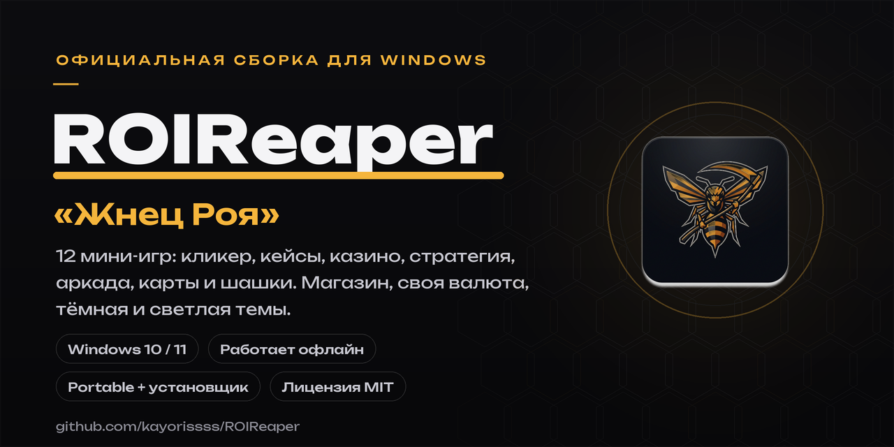

<div align="center">



# 🐝 ROIReaper — «Жнец Роя»

**Официальный сборник мини-игр для Windows: двенадцать проработанных режимов, магазин, своя валюта, тёмная и светлая темы, встроенные обновления.**
Работает полностью офлайн и запускается прямо с флешки.

[](https://github.com/kayorissss/ROIReaper/releases/latest)
[](https://github.com/kayorissss/ROIReaper/actions/workflows/ci.yml)
[](LICENSE)
[](#-системные-требования)
[](#-скачать)

<br>

<a href="https://github.com/kayorissss/ROIReaper/releases/latest">
</a>
&nbsp;
<a href="https://github.com/kayorissss/ROIReaper/releases/download/v1.0.1/ROIReaper-1.0.1-Portable.zip">
</a>
&nbsp;
<a href="https://github.com/kayorissss/ROIReaper/releases/download/v1.0.1/ROIReaper-Setup-1.0.1.exe">
</a>

</div>

---

## 📋 Содержание

- [Возможности](#-возможности)
- [Режимы](#-режимы)
- [Скачать и запустить](#-скачать-и-запустить)
- [Управление](#%EF%B8%8F-управление)
- [Обновления](#-обновления)
- [Раздел «О компьютере»](#-раздел-о-компьютере)
- [Разработка](#-для-разработчиков)
- [Как помочь проекту](#-как-помочь-проекту)
- [Безопасность](#-безопасность)
- [Лицензия](#-лицензия)

---

## ✨ Возможности

- 🎮 **12 режимов в одном приложении** — кликер, кейсы, полноценное казино, стратегия, аркада, карты и шашки.
- 🎨 **Официальный тёмный интерфейс** (чёрный, тёмно-серый, янтарный акцент) и переключаемая **светлая тема**; шрифт **Unbounded**.
- 🏪 **Магазин плюшек**: палитры, скины жнеца, рубашки карт, билеты, подковы удачи, постоянные усиления.
- 🍯 **Своя экономика**: валюта «мёд», престиж «королевское желе», ежедневные награды со стриком, статистика.
- 💾 **Автосохранение**, экспорт и импорт сейва в файл — прогресс переносится между ПК.
- 🔄 **Встроенные обновления**: проверка GitHub-релизов, список изменений, загрузка внутри программы с процентами.
- 🖥 **Страница «О компьютере»**: Windows, безопасность, железо — красиво и без установки чего-либо.
- ⚡ Лёгкий (~0,6 МБ), без рекламы, без телеметрии, **работает офлайн**, запускается **с флешки**.
- 🪟 Две сборки: **Portable ZIP** (без установки и UAC) и **установщик EXE** (ярлыки, удаление через «Программы и компоненты»).

## 🎮 Режимы

| Игра | Что внутри |
|---|---|
| 🐝 **Жатва Роя** | Кликер: 8 построек, 13 улучшений, криты, золотая дикая оса, офлайн-доход и престиж |
| 📦 **Кейсы** | 6 кейсов, прокрутка с замедлением, 5 редкостей вплоть до реликтов, трофейный зал, бесплатный кейс раз в 20 минут |
| 🎰 **Слоты** | 5×3, 20 линий, вайлды, скаттеры, 10 фриспинов с ×3, бонус казино каждые 20 минут |
| 🎡 **Рулетка** | Европейская (одно зеро), полный стол ставок, анимированные колесо и шарик, история, повтор ставок |
| 🃏 **Блэкджек** | Колода 52 × 4, удвоение, дилер останавливается на 17, блэкджек платит 3:2 |
| 🎲 **Кости** | Порог «больше/меньше», множитель до ×98, слайдер вероятности |
| 🪙 **Орёл и Решка** | Быстрая монетка, серии побед, 3D-анимация броска |
| 👑 **Империя Роя** | Пошаговая стратегия в духе Europa Universalis: карта провинций, экономика по месяцам, армии, крепости, технологии, события и три ИИ-улья |
| 🥷 **Уклонение** | Человечек против босса-шефа: WASD / стрелки / мышь, рывок, 8 паттернов атак, near-miss бонусы, частицы и тряска |
| ⚫ **Шашки** | Русские шашки против ИИ (минимакс с альфа-бетой, 3 уровня сложности), обязательные взятия, дамки |
| 🂠 **Дурак** | Подкидной против ИИ: колода 36, козырь, подкиды, «бито / беру», полный цикл партии |
| 🔢 **2048** | Классика на стрелках, WASD и свайпах, награда за плитку 2048, рекорд |

## ⬇️ Скачать и запустить

> ⚠️ Если SmartScreen покажет предупреждение у самоподписанного установщика — **«Подробнее → Выполнить всё равно»**. Исходный код открыт, в приложении нет ничего, кроме статичной игры.

### 🧷 Вариант 1. Portable — на флешку, без установки

1. Скачайте **`ROIReaper-1.0.1-Portable.zip`** (кнопка выше или со [страницы релизов](https://github.com/kayorissss/ROIReaper/releases/latest)).
2. Распакуйте в любую папку — на флешку, Рабочий стол, в документы.
3. Запустите **`ROIReaper.cmd`** (или **`start.vbs`** — без мигающего окна консоли).

Права администратора и установка не нужны. Профиль с сохранениями лежит рядом, в папке `profile`, — флешка переносит вместе с прогрессом.

### 💻 Вариант 2. Установщик — ярлыки и «Программы и компоненты»

1. Скачайте **`ROIReaper-Setup-1.0.1.exe`**.
2. Запустите: программа установится в `%LOCALAPPDATA%\ROIReaper` **без UAC**, появятся ярлыки на рабочем столе и в меню Пуск.
3. Удаление — стандартное: «Параметры → Приложения» или «Программы и компоненты → Удалить ROIReaper».

Контрольные суммы SHA-256 публикуются в [заметках релиза](https://github.com/kayorissss/ROIReaper/releases/latest).

### 🖧 Системные требования

- **Windows 10 или 11** с Microsoft Edge (есть по умолчанию), либо Chrome / Brave.
- ~2 МБ свободного места, права администратора не требуются.
- Интернет не нужен — в сеть по желанию ходит только проверка обновлений.

## ⌨️ Управление

| Клавиши | Действие |
|---|---|
| **F11** | Полноэкранный режим |
| **M** | Звук вкл/выкл |
| **1–9** | Быстрый переход к играм |
| **WASD / стрелки / мышь / Space** | Аркада, 2048, слоты, кости и монетка |
| **P** | Пауза в «Уклонении» |
| **R / Enter** | Рестарт режима |

## 🔄 Обновления

**Настройки → Обновления → «Проверить обновления»**. Приложение сверяется с GitHub-релизами и умеет:

- показать уведомление и список изменений при выходе новой версии;
- скачать новую сборку **внутри себя** — с процентами, этапами и анимацией;
- открыть страницу релиза и репозиторий на GitHub.

История версий — в [CHANGELOG.md](CHANGELOG.md).

## 🖧 Раздел «О компьютере»

Read-only сводка о системе, собранная локальным лаунчером через WMI (ничего не устанавливается и никуда не отправляется):

- версия и сборка Windows, модель и серийный номер устройства;
- процессор (ядра/потоки/частота), объём и планки ОЗУ, видеокарты и драйверы;
- диски и свободное место, BIOS/UEFI;
- состояние **Secure Boot**, брандмауэра и антивируса;
- рабочая группа/домен и сетевые адаптеры.

## 🛠 Для разработчиков

Требуется Node.js **18+**; внешних рантаймов и фреймворков у приложения нет — только чистый HTML/CSS/JS.

```bash
npm install        # зависимости (jsdom для тестов, 7zip-bin для сборки)
npm start          # предпросмотр: http://localhost:8848/index.html
npm test           # юнит- и регрессионные тесты всех режимов
node tools/stress-games.js   # стресс-харнес: сотни автопартий без зависаний
npm run icon       # перегенерировать иконки из resources/icon-src.png
npm run dist       # собрать Portable ZIP и Setup EXE в dist/
python3 scripts/make-banner.py   # пересобрать баннер репозитория
```

Структура репозитория:

```
.github/           CI (тесты), релизная сборка, шаблоны issue
src/renderer/      приложение: HTML/CSS/JS без фреймворков
  js/games/        все двенадцать мини-игр
windows/           лаунчер: PowerShell + .cmd/.vbs, установка и удаление
resources/         иконки и SFX-модуль установщика
scripts/           сборка дистрибутивов, иконки, баннер
tools/             dev-сервер, юнит-тесты и стресс-харнес
docs/              баннер и графика репозитория
```

Релизные ZIP и EXE собираются и прикрепляются автоматически воркфлоу
[**Сборка релиза**](.github/workflows/release.yml) при пуше тега `v*` —
файлы появляются прямо в релизе, вместе с контрольными суммами в логе сборки.

## 🤝 Как помочь проекту

- 🐞 Нашли баг — оформите [issue по шаблону](https://github.com/kayorissss/ROIReaper/issues/new/choose): версия, режим, как воспроизвести.
- 💡 Есть идея новой игры или механики — расскажите в [Issues](https://github.com/kayorissss/ROIReaper/issues/new/choose).
- 🔧 Пул-реквесты приветствуются: порядок описан в [CONTRIBUTING.md](CONTRIBUTING.md).
- ⭐ Поставьте звезду, если проект зашёл.

## 🔒 Безопасность

Приложение не собирает персональные данные, не содержит телеметрии и работает офлайн.
Сохранение лежит в локальном профиле и может быть экспортировано в файл.
О возможных уязвимостях сообщайте согласно [SECURITY.md](SECURITY.md) — не публикуйте детали в открытых issue.

## 📄 Лицензия

Проект распространяется под лицензией **[MIT](LICENSE)**. Фирменная иконка «Оса-жнец» — часть проекта.

<div align="center">

<br>

**[🐝 ROIReaper](https://github.com/kayorissss/ROIReaper)** · сделано для игры на парах в колледже 🍯

<a href="https://github.com/kayorissss/ROIReaper/releases/latest"></a>

</div>
